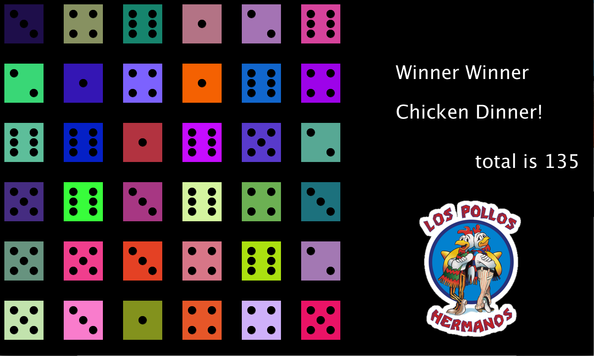
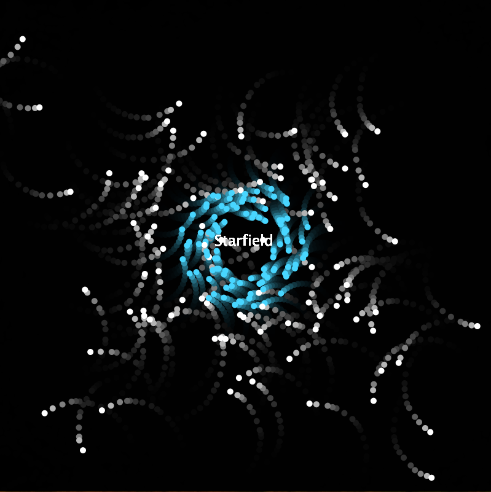

# _Caleb Ockwig's Computer Science Portfolio!_
<details> 
  <summary><b>Web Page</b></summary> 
  <a href="https://ockwigc.github.io/OckwigWebPage2/">Link!</a>
  
 
  <p> <b>About the Project</b> <br>I thought it was a good way to introduce HTML and CSS into the course. Some problematic areas were lining up the pictures and getting them to show correctly. Other than that I was able to use html to create bodies and headers, and even links to websites (I used the same things here for these links) Anyway, If you wanna see some good pictures of my dog! click it.</p>
  </details>
  <br>

  <details> 
  <summary><b> Lightning!</b></summary>
  <p> <b>About the Project</b> <br> I thought this project was fun. I had some tough time starting out but I figured it out and initally the 'lightning' was supposed to be one color but I thought it looked cooler with it being random and changing color so I kept it. Another feature I added was sthe ability to clear away the screen by making a simple button of if the mouse is clicked between X and Y and then just making the screen either black or white. </p>
  <p>
  </details>
  <br>

  <details><summary> <b>Dice</b> </summary>
 
  <a href="https://ockwigc.github.io/dice3/">Link!</a>
  <p> <b>About the Project</b> <br> This project was good at re-introducing the Math class and Math.random(). It was fun to make it random colors too. The most challenging part was making the counter. I initially had it as a void method but that wasn't changing the sum the way I wanted it to so I ended up changing it to an int method which solved my issue.</p>
  </details>
  <br>

  <details> <summary> <b>Chemotaxis </b></summary>
  <a href="https://ockwigc.github.io/chemotaxis4/">Link!</a>
  <p> <b>About the Project</b> <br> The hardest part of this was to make the shapes follow you up until it is a box around you. After that they move in a random pattern which brings them around the box where they _might_ be able to touch the mouse.
  </p>
  </details>
  <br>

  <details><summary><b> Starfield</b> </summary>
   
  <a href="https://ockwigc.github.io/starfield5/">Link!</a>
  <p> <b>About the Project</b> <br> This project offered more experience using the Math class such as Math.cos() and Math.sin(). The hardest part was getting the particles to bounce around the screen and using an interface. </p>
  </details>  
  <br>

  <details> <summary><b> College Presentation </b></summary>
<a href="https://docs.google.com/presentation/d/e/2PACX-1vTOROAp5601MPr28pQ-yjpbVH7zN_lOFOv4SHpJflWcWFjNYG-UB2A5JB_5MDFEKUerzCmiDd7gl286/pub?start=false&loop=false&delayms=3000">Link!</a>
  </details>
  
<details><summary><b> Pokedex</b></summary>
  <p><b>About the project:</b>This project I was given the freedoms of making whatever I wanted as long as I used a map. The challengng part was reading the data files, then assinging a value of stats, a pokedex number, and type to a Pokemon key. This is probably the project I am most proud of because it peaked my interest, and is something I am very interested in.
  <a href="https://imgur.com/a/am1KeBe">Link!</a>
  </details>
  
  * ChallengingCode!


```Java
  Scanner scan=new Scanner(f);
      while (scan.hasNextLine()) {
        String line=scan.nextLine();
        String [] dat=line.split(" ");
        int i = 0;
        String name=dat[i];
        i++;
        while (!isNum(dat[i])) {
          name+= " "+dat[i];
          i++;
        }
        int dexNo=parseInt(dat[i]); 
        i+=4;
        String types=""+dat[i];
        types=types+" "+dat[i+1];
        i+=2;
        String abil="";
        for (int z=i; z<dat.length; z++) {
          abil=abil+dat[z]+" ";
        }
        if (dex.get(name)==null) {
          dex.put(name, new ArrayList<String>());
        }
        dex.get(name).add(""+dexNo);
        dex.get(name).add(types);
        dex.get(name).add(abil);
      }
    }
    catch(Exception e) {

      e.printStackTrace();
    }
  }
  ```
This code was challenging because it was the first time I've had to read from a file. I had to write a method that would check if a string could be parsed int a double and if it couldn't I would know that it was a pokemon with a two or three word name. All of this would add into the map which would be the pokemon.
